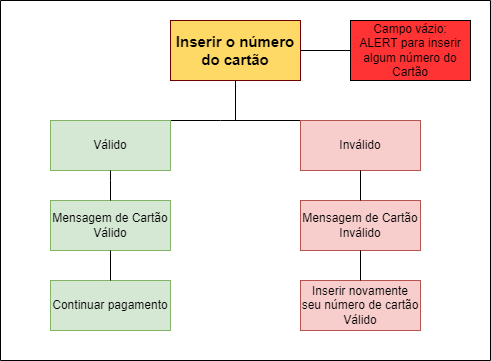

# Cartão de Crédito Válido

## Índice

* [1. Introdução](#1-Introdução)
* [2. Resumo do projeto](#2-resumo-do-projeto)
* [3. Considerações gerais](#3-considerações-gerais)
* [4. Marco: Critérios de Aceitação Mínimos do Projeto](#4-marco-critérios-de-aceitação-mínimos-do-projeto)
* [5. Marco Opcional: Mostrar a franquia do cartão](#5-marco-opcional-mostrar-a-franquia-do-cartão)
* [6. Considerações técnicas](#6-considerações-técnicas)
* [7. Objetivos de aprendizagem](#7-objetivos-de-aprendizagem)
* [8. Guias, dicas e leituras
  complementares](#8-guias-dicas-e-leituras-complementares)
* [9. Para considerar o feedback do projeto](#9-para-considerar-o-feedback-do-projeto)

***

## 1. Introdução

O [algoritmo de Luhn](https://en.wikipedia.org/wiki/Luhn_algorithm), também
chamado de módulo 10, é um método de soma de verificação, usado para validar
números de identificação, como o IMEI de telefones celulares, cartões de crédito
etc.

Esse algoritmo é simples. Obtemos o inverso do número a ser verificado (que
contém apenas dígitos [0-9]); todos os números que ocupam uma posição par devem
ser multiplicados por dois; se esse número for maior ou igual a 10, devemos
adicionar os dígitos do resultado; o número a verificar será válido se a soma de
seus dígitos finais for um múltiplo de 10.

## 2. Resumo do projeto

BANKORZ

Foi desenvolvido um site para usuários de todo o Brasil poderem confirmar se seu cartão é válido ou não. Antes de qualquer compra em alguma loja, você poderá entrar em nosso site para verificar, basta digitar seu número de cartão, seu nome e a validade do cartão.

## 3. Desenvolvimento do projeto

Primeiro foi pensado em um layout

Em seguida em um fluxograma

## 4. Projeto Final

Tela inicial

Após o usuário clicar no botão Clique aqui, irá para outra página, a seguir imagem da tela para verificar seu cartão

Se seu cartão for válido, aparecerá um ALERT dizendo que sua compra poderá ser feita. Caso contrário, será inválido e deverá inserir novamente um número de cartão válido.

## 5. Ferramentas Utilizadas

HTML 
CSS 
JavaScript 
Git 
Github 

